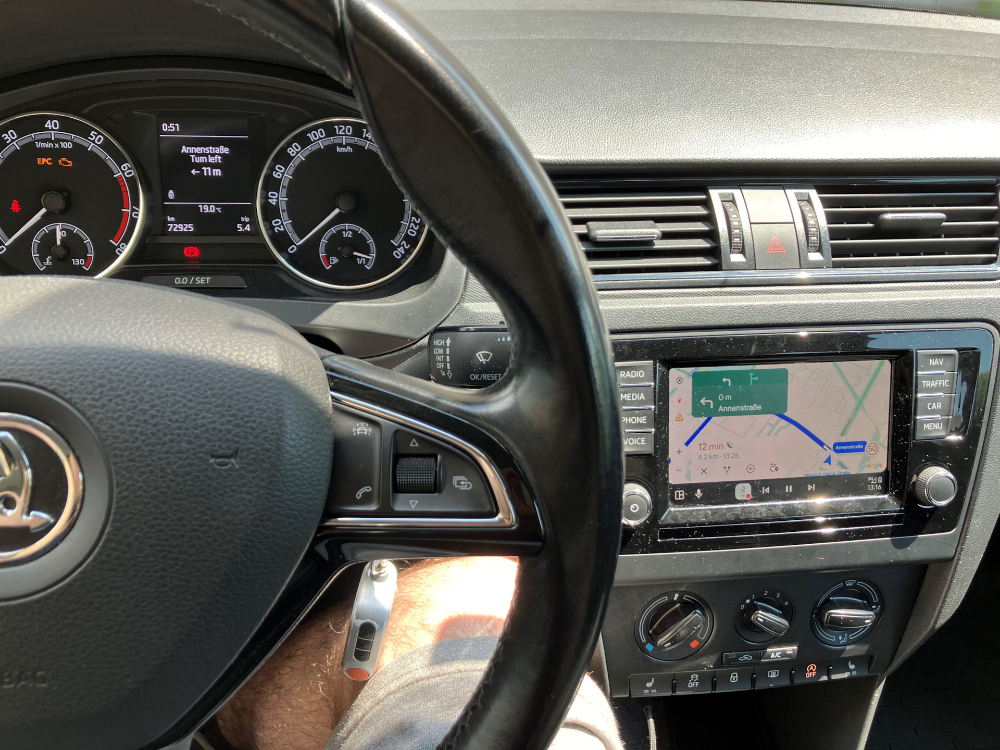

# AAtoKombi — Android Auto navigation on the MIB2 STD2 instrument cluster

Show Android Auto turn-by-turn navigation (and player info) on the
instrument cluster of a **VW MIB2 STD2 / MST2** unit (TechniSat / Preh).

```
      Hauptstrasse
      Turn right
   ►  300 m
```

Stock MIB2 STD2 cannot do this: the firmware deliberately leaves the Android Auto
navigation bridge disabled, and the cluster is not coded for navigation. AAtoKombi adds the
missing pieces — without reflashing the firmware and **fully reversible**.

> **Status:** working (navigation in the cluster's media widget, or the real Navigation menu on a
> nav-capable cluster, + real now-playing track).
> Personal/educational modding project. Use COMPLETELY at your own risk.

## Demo

[](https://www.youtube.com/watch?v=Qn0900pUQZw)

▶ **[Watch the demo on YouTube](https://www.youtube.com/watch?v=Qn0900pUQZw)**

---

## How it works (in one picture)

```
 Android Auto (phone)
      │  turn-by-turn is inside Google's libext.google.gal.receiver.so,
      │  but the stock SAL never registers the navigation endpoint
      ▼
 ┌─ shim/ ──────────────────────────────────────────────┐
 │ patched libgal: registers Google's NavigationStatus   │
 │ AND MediaPlaybackStatus endpoints itself, captures    │
 │ road/maneuver/distance + track Title/Artist/Album,    │
 │ writes them to /dev/shmem/aa_nav + aa_media           │
 └───────────────────────────────────────────────────────┘
      │
      ▼  /dev/shmem/aa_nav + aa_media   (plain text, one line per update)
 ┌─ jar/ ───────────────────────────────────────────────┐
 │ HMI Java mod (loaded via -Xbootclasspath/p): reads     │
 │ the files and renders the text. On a non-nav cluster   │
 │ it injects the maneuver into the MEDIA now-playing      │
 │ widget (CurrentStationInfo) — which the cluster already │
 │ draws ("Android Auto" label); the real track shows when │
 │ no route guidance is active. On a nav-capable cluster   │
 │ (e.g. Amundsen) it instead drives the real navsd        │
 │ Navigation menu. The path is picked at runtime          │
 │ (ClusterCaps.isNavCapable()).                           │
 └───────────────────────────────────────────────────────┘
      │
      ▼
 Instrument cluster — Media tab (or the Navigation menu) shows the live maneuver / track
```

The navsd path is documented separately in [`docs/NAVIGATION_VIA_NAVSD.md`](docs/NAVIGATION_VIA_NAVSD.md).

Two key findings drive the design (both verifiable on the binaries):

1. **The data is already in the firmware, just disabled.** Google's
   `libext.google.gal.receiver.so` fully implements `NavigationStatusEndpoint`
   (handlers + vtable), but the stock SAL references it **0 times** — it only registers
   `BluetoothEndpoint`. The shim registers it for us — and the same way for the media
   now-playing endpoint (built); the phone endpoint is the same recipe, researched. See `docs/`.
2. **The cluster won't take nav in the nav slot** when the unit isn't nav-coded, but it *does*
   render the media now-playing widget — so we put the nav text there. A nav-coded cluster (e.g.
   Amundsen) *does* take the nav slot, so there we drive the real navsd Navigation menu instead;
   the path is chosen at runtime.

Full write-up: [`docs/ARCHITECTURE.md`](docs/ARCHITECTURE.md) (and
[`docs/NAVIGATION_VIA_NAVSD.md`](docs/NAVIGATION_VIA_NAVSD.md) for the nav-capable path).

---

## Repository layout

```
jar/      HMI Java mod  → builds AAtoKombi.jar
  src/        our sources (incl. faithful shadows of several stock classes: the audio + AA targets
              and the navsd nav functions)
  build.sh    one-command build (javac + jar)
  lib/        ← MIBHMI.jar (staged here by build.sh from the MIBHMI.jxe)

shim/     native libgal patch → builds the patched .so
  src/navshim_fs.cpp   freestanding ARM listener (nav + media → /dev/shmem)
  inject.py            ELF injector (auto-resolves addresses, adds the blob, patches init's BL)
  build.sh             compile + link + inject
  DESIGN.md            nav reverse-engineering spec
  DESIGN_MEDIA.md      now-playing (MediaPlaybackStatusEndpoint) reverse-engineering spec
  lib/        ← put unit's libext.google.gal.receiver.so here

docs/     ARCHITECTURE.md          — the design + reverse-engineering write-up (shim RE notes live in shim/)
          NAVIGATION_VIA_NAVSD.md  — the nav-capable (navsd Navigation-menu) output path

build.sh          one-button build of BOTH artifacts from the toolbox dumps (all in Docker)
docker/           the build toolchain image (JDK 8 + clang + lld + pyelftools)
tools/
  extract-mibhmi.sh   (optional) install + verify a firmware's MIBHMI.jar against the shadows
  unpack-ifs.py       (optional) pure-Python QNX6 IFS unpacker (pull MIBHMI.jxe out of a HMI image,
                      no QNX SDP / dumpifs needed)
```

The on-device **deployment** (SD card, Green Engineering Menu, activate/deactivate scripts)
lives in a separate toolbox repository —
[olli991/mib-std2-pq-zr-toolbox](https://github.com/olli991/mib-std2-pq-zr-toolbox) — this repo
only builds the two artifacts.

---

## Patch the unit (step by step)

You build the two artifacts **against the exact files from your own unit**, then deploy them back
with the toolbox. Nothing here is firmware-version-specific — the shim auto-adapts across STD2
firmware builds. (Development was done on **`MST2_EU_SK_ZR_P0480T`**.)

### 0. Prerequisites (once)
- **The deployment toolbox** ([olli991/mib-std2-pq-zr-toolbox](https://github.com/olli991/mib-std2-pq-zr-toolbox)) set up for your unit.
- **Docker** — the whole build runs in containers (jxe2jar + the JDK 8 / clang / lld / pyelftools
  toolchain), so nothing else needs installing.

### 1. Pull the two files off the unit (with the toolbox)
Use the toolbox's **"Dump files"** menu item to copy these from the unit to your computer:
- **`MIBHMI.jxe`** — the HMI executable (from `/tsd/hmi/ifs/`). `build.sh` turns it into the HMI
  compile classpath (`MIBHMI.jar`) for you, inside Docker.
- **`libext.google.gal.receiver.so`** — the stock GAL library (from `/tsd/lib/sal/gal/`). This is
  the file we patch, so it **must be the copy from the unit** (different firmware builds differ —
  that's exactly what the shim's auto-resolve handles).

> Keep an untouched backup of the original `libext.google.gal.receiver.so` — the toolbox's
> Disable step restores it, but a manual backup is cheap insurance.

### 2. Build both artifacts
```sh
./build.sh /path/to/your/MIBHMI.jxe /path/to/your/libext.google.gal.receiver.so
# -> dist/AAtoKombi.jar                  (the HMI mod)
# -> dist/libext.google.gal.receiver.so  (the patched libgal)
```
Everything runs in Docker: it converts the `.jxe` to a jar, builds the toolchain image (cached
after the first run), compiles both artifacts inside the container with the repo bind-mounted, and
drops the two deployables in `dist/`. Inputs and outputs are only ever bind-mounted.

`inject.py` prints the per-firmware addresses it **auto-resolved** from your libgal:
```
resolved galrefs from libgal:
    R_REGISTER     = 0x...   R_NAV_VTABLE = 0x...   R_GOT_MEMSET   = 0x...
    R_ONCHOPEN     = 0x...   R_MEDIA_VTABLE = 0x...
BL patch site: file offset 0x... [auto]
```
Optional sanity-check: these match `nm -D your_libgal`. If the `BL` auto-locator ever fails on an
unusual build, pass `--bl-offset 0xNNNN` to `inject.py`.

> The jar contains faithful **shadows** of several stock classes (`CurrentStationInfo`,
> `AndroidAutoTarget`, and the navsd nav functions). They are derived from the dev unit's
> firmware; within a firmware branch they are usually compatible — rebuilding against *your*
> `MIBHMI.jar` (which `build.sh` produces from the `.jxe`) keeps them in sync.

### 3. Deploy both artifacts back to the unit (with the toolbox)
Put the two `dist/` outputs onto the toolbox SD card, then run the toolbox's Enable step:
- copy `dist/AAtoKombi.jar` to the SD `custom/java/` folder,
- copy `dist/libext.google.gal.receiver.so` to the SD `custom/sal/...gal/` folder.

The Enable step then installs the jar onto the HMI `-Xbootclasspath/p` (in `runHMI.sh`) and swaps in
the patched libgal (keeping a backup of the original).

It's **fully reversible** — the toolbox's Disable removes the jar from the bootclasspath and
restores the original libgal. Nothing is written to flash by the mod itself (the captured data
goes through `/dev/shmem`, a RAM filesystem).

### 4. Verify on the unit
- Connect your phone over Android Auto and start navigation → the cluster's media tab shows the
  maneuver + street; play music with no active route → it shows the real Title/Artist/Album.
- If something's off, check `/dev/shmem/aa_nav.dbg` (should read `... libc=ok ... registered ...
  media-registered`) and the `MIBLogger` output for `AANavReader` / `ShmemMediaReader` lines.

### Advanced (optional)
- **Verify the shadows against your firmware first.** If you already have a `MIBHMI.jar` (or only the
  whole HMI image — pull `MIBHMI.jxe` out of it with `tools/unpack-ifs.py your_hmi.ifs`, no QNX SDP
  needed), check it before building:
  ```sh
  CFR=/path/to/cfr.jar tools/extract-mibhmi.sh /path/to/your/MIBHMI.jar
  ```
  It installs the jar at `jar/lib/MIBHMI.jar` and runs `javap` checks that the stock classes we
  shadow (`CurrentStationInfo`, `AndroidAutoTarget`, …) still expose the members our shadows rely
  on (with `$CFR` set it also decompiles them into `jar/reference/` for a manual diff against
  `jar/src/`).
- **Build a single piece locally** (without the Docker toolchain — needs **JDK 8** whose `javac`
  still accepts `-source/-target 1.3`, plus `clang`, `ld.lld`, `python3` + `pyelftools`):
  ```sh
  ( cd jar  && JAVAC=/jdk8/bin/javac JAR=/jdk8/bin/jar ./build.sh )      # -> jar/build/AAtoKombi.jar
  ( cd shim && ./build.sh /your/unit/libext.google.gal.receiver.so )    # -> shim/build/libext.google.gal.receiver.so
  ```
  (`jar/build.sh` still needs a `MIBHMI.jar` at `jar/lib/`; the `.jxe → .jar` conversion itself is
  Docker-only.)

---

## What works / what's planned

| Feature | State | Notes |
|---|---|---|
| Nav maneuver + street on cluster | ✅ working | media widget on a non-nav cluster; the real navsd **Navigation** menu (arrow + distance + street) on a nav-capable one. See `docs/NAVIGATION_VIA_NAVSD.md` |
| Maneuver arrow (turn / u-turn / roundabout exit) | ✅ working | hardware-tuned glyph + bearing; roundabout exit synthesized from the AA exit number for Yandex (which sends angle 0) |
| Distance-to-turn | ✅ working | populates while driving (run through the cluster's own formatter) |
| Time-to-turn | 🟡 partial | `TimeToTurnSeconds` stayed 0 even on the road — AA appears not to forward it |
| Real now-playing track on cluster | ✅ working | patched GAL `MediaPlaybackStatusEndpoint` → `/dev/shmem/aa_media` → media widget; shown when no route guidance is active, and as a Q4 marquee during guidance. See `shim/DESIGN_MEDIA.md` |
| Caller ID from AA (phone) | 🔎 researched | AA has a full `PhoneStatusEndpoint`; same shim+shadow recipe |

ETA-to-destination is **not** available — Android Auto does not project it to the car
(only next-turn data). See `docs/ARCHITECTURE.md`.

## Roadmap
- ✅ Auto-resolve shim addresses from the target libgal (symbols + relocations + `.plt`, and the
  `init` `BL` site) so one package adapts to any firmware version without manual reversing.
- ✅ Real now-playing track from AA (`MediaPlaybackStatusEndpoint`) — same shim recipe as nav.
- Phone caller-ID feature.

## Credits
AAtoKombi is a port of **[adi961/mib2-android-auto-vc](https://github.com/adi961/mib2-android-auto-vc)**
(Android Auto navigation on the cluster for MIB2 **High** / MHI2) to MIB2 **STD2** / MST2. The HMI
side — the AA target handling, the navigation handler, and the `de.adi961.miblogger` logger — comes
from that project. adi961's mod in turn builds on the LSD/bootclasspath work of
[grajen3](https://github.com/grajen3/mib2-lsd-patching) and
[andrewleech](https://github.com/andrewleech). The STD2 shim and the media-widget approach are new
here.
